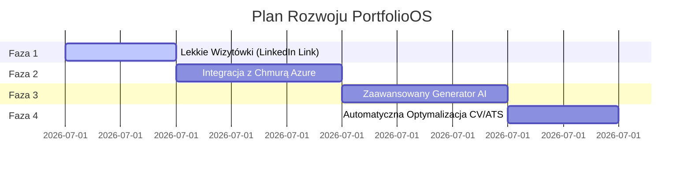

<div align="center">
</div>

# 🚀 PortfolioOS — Smart Visual Card & Interaktywny Profil-Wizytówka

**PortfolioOS** to innowacyjna platforma webowa, która pozwala każdemu stworzyć interaktywny, profesjonalny profil-wizytówkę (Smart Visual Card). Stanowi ona idealne uzupełnienie tradycyjnego CV oraz profilu na portalu LinkedIn, oferując nowoczesne, bogate wizualnie i funkcjonalne rozszerzenie tożsamości zawodowej.

Głównym celem aplikacji jest dostarczenie prostego w obsłudze i przejrzystego narzędzia do prezentowania swoich umiejętności, projektów oraz ścieżki kariery w sposób, który przyciąga uwagę rekruterów i klientów.

---

## 💡 Główne Założenia Aplikacji

1. **Uzupełnienie CV i LinkedIn:** Aplikacja generuje unikalną, dynamiczną wizytówkę, którą można w prosty sposób podlinkować w pliku PDF z tradycyjnym CV, w stopce e-maila lub w sekcji "Kontakt" na LinkedIn.
2. **Bezpieczny Profil w Chmurze Azure:** Zaawansowana integracja z chmurą Microsoft Azure gwarantuje pełne bezpieczeństwo danych profilowych i ich wysoką dostępność.
3. **Zaawansowany Generator AI:** Narzędzie oparte o sztuczną inteligencję (Gemini), które analizuje dotychczasowe portfolio użytkownika, automatycznie zbiera i strukturyzuje kluczowe informacje zawodowe, a następnie optymalizuje je pod kątem pożądanego stanowiska.
4. **Fallback na Agenty Azure (Niezawodność):** W przypadku wyczerpania limitów tokenów/zapytań (quota exhaustion) w API Gemini, architektura aplikacji zakłada automatyczne przełączenie (failover) na niezależne agenty AI hostowane w chmurze **Microsoft Azure** (Azure OpenAI / Custom Container Agents) — *rozwiązanie w fazie projektowej*.

---

## 🗺️ Roadmapa Rozwoju Projektu

Poniższa roadmapa przedstawia kolejne kroki rozwoju PortfolioOS w stronę profesjonalnego generatora profili zintegrowanego z chmurą Azure.



### 🟩 Faza 1: Szablony Wizytówek (Smart Visual Cards)
* **Szablony Link-in-Bio / LinkedIn Showcase:** Lekkie widoki zoptymalizowane pod szybki start bezpośrednio z linku na profilu LinkedIn lub w papierowym CV.
* **Integracja z LinkedIn API:** Szybkie logowanie i import podstawowych danych profilowych na start.

### 🟨 Faza 2: Bezpieczne Przechowywanie w Chmurze Azure
* **Azure Database & Storage:** Migracja/replikacja bazy danych konfiguracji portfolio do Microsoft Azure (Azure Cosmos DB lub Azure SQL) w celu zapewnienia maksymalnego poziomu bezpieczeństwa klasy Enterprise.
* **Azure Blob Storage:** Szybki i bezpieczny hosting plików (zdjęć projektów, miniatur, dokumentów PDF z CV) w chmurze Azure z integracją z siecią CDN.

### 🟦 Faza 3: Zaawansowany Generator AI (Kolektor Informacji)
* **Inteligentny Parsing i Synteza:** Generator AI analizuje obecne projekty, opisy oraz historię pracy wpisaną przez użytkownika, wyciąga z nich esencję i automatycznie przygotowuje rozbudowane opisy umiejętności, podsumowania profilu oraz rekomendowane usprawnienia.
* **Azure Agentic Fallback:** Wdrożenie niezależnych agentów na platformie Azure Container Apps jako zapasowej warstwy obliczeniowej AI w przypadku ograniczeń przepustowości Gemini.

### 🟥 Faza 4: Narzędzia do Dystrybucji i Dopasowania (ATS Checker)
* **ATS Compatibility Checker:** Moduł AI analizujący zbieżność profilu z wybranymi ofertami pracy i sugerujący zmiany w słowach kluczowych.
* **Eksporter Danych:** Narzędzie do generowania zoptymalizowanych plików vCard oraz linków śledzących (kto i kiedy kliknął w nasze portfolio z poziomu LinkedIn).

---

## 🛠️ Jak Uruchomić Projekt Lokalnie

### Wymagania:
- Zainstalowane środowisko **Node.js** (LTS)

### Instrukcja:
1. Zainstaluj zależności:
   ```bash
   npm install
   ```
2. Skopiuj plik `.env.example` jako `.env.local` i ustaw wymagane zmienne środowiskowe.
3. Uruchom serwer deweloperski:
   ```bash
   npm run dev
   ```
4. Otwórz adres `http://localhost:5173` w przeglądarce.
